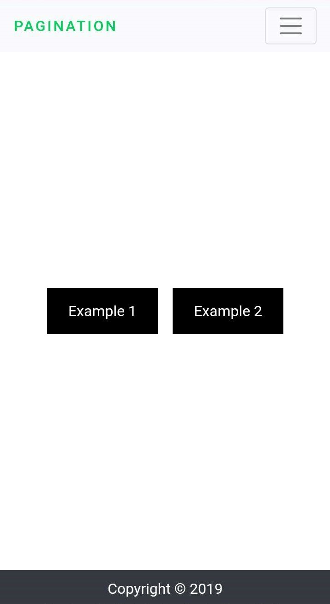
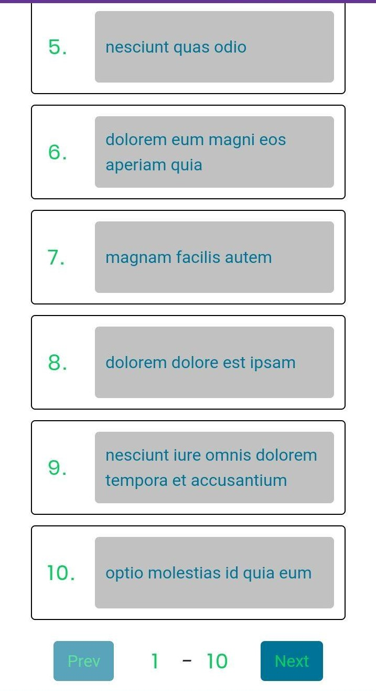
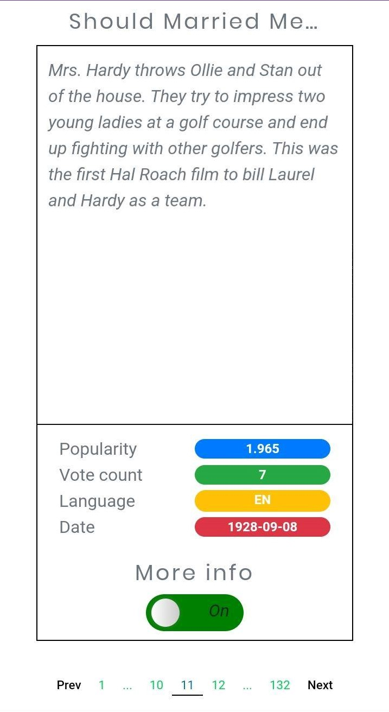

# Pagination examples
Two different pagination examples with data from JSONPlaceholder & The Movie Database.

## Screenshots
| Home | Example One | Example Two | More info |
|:----:|:----:|:----:|:-------:|
| |  | | 

## Built WithJSONPlaceholder- Front-end
  - "axios": "^0.19.0",
  - "babel-plugin-styled-components": "^1.10.6",
  - "bootstrap": "^4.4.1",
  - "classnames": "^2.2.6",
  - "dotenv": "^8.2.0",
  - "gatsby": "^2.18.4",
  - "gatsby-image": "^2.2.34",
  - "gatsby-plugin-manifest": "^2.2.30",
  - "gatsby-plugin-offline": "^3.0.24",
  - "gatsby-plugin-react-helmet": "^3.1.16",
  - "gatsby-plugin-sass": "^2.1.24",
  - "gatsby-plugin-sharp": "^2.3.4",
  - "gatsby-plugin-styled-components": "^3.1.14",
  - "gatsby-source-filesystem": "^2.1.39",
  - "gatsby-transformer-sharp": "^2.3.6",
  - "node-sass": "^4.13.0",
  - "prop-types": "^15.7.2",
  - "react": "^16.12.0",
  - "react-dom": "^16.12.0",
  - "react-helmet": "^5.2.1",
  - "react-paginate": "^6.3.2",
  - "react-redux": "^7.1.3",
  - "redux": "^4.0.4",
  - "redux-persist": "^6.0.0",
  - "redux-thunk": "^2.3.0",
  - "reselect": "^4.0.0",
  - "styled-components": "^4.4.1"
